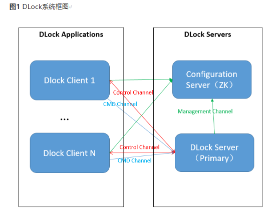
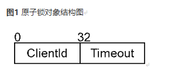
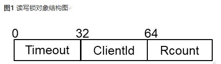

# DLock

## 1. 介绍
DLock是基于UMDK构建的通用分布式锁服务，达成了分布式锁低时延和高可靠的目标，支持原子锁、读写锁和公平锁。另外，DLock提供分布式状态对象管理服务，提供设置、获取全局事务对象的能力，可加速全局事务资源统一分配，为数据库等场景多写多读提供基础能力。

## 2. 使用说明
DLock对外封装的接口保存在"src/ulock/dlock/lib/include"文件夹下，其中server侧的接口在文件"dlock_server_api.h"里，client侧的接口在文件"dlock_client_api.h"里，对外数据结构保存在“dlock_types.h"中，相关接口的使用说明详见DLock接口手册。

## 3. 编译安装
### 编译DLock RPM包
**单独编译DLock**
进入UMDK工程根目录下
```bash
tar -czf /root/rpmbuild/SOURCES/umdk-25.12.0.tar.gz --exclude=.git `ls -A`
rpmbuild -ba umdk.spec --with dlock
```

**DLock额外编译选项说明**
- RPM Compilation Options: \
--with ubagg_disable                      (option, i.e. enable ubagg by default) \
--with asan                                       (option, i.e. disable asan by default) \
--with tsan                                        (option, i.e. disable tsan by default) \
--with gcov                                        (option, i.e. disable gcov by default)

### 安装DLock RPM包
说明: DLock需要和URMA功能一起工作，在编译及安装DLock前，需要保证URMA已经进行了安装。\
rpm -ivh /root/rpmbuild/RPMS/aarch64/umdk-dlock-*.rpm

### 通过cmake命令编译安装
**单独编译DLock**
进入src目录运行cmake命令进行编译以及安装
```bash
cd src
mkdir build; cd build
cmake .. -DBUILD_ALL=disable -DBUILD_DLOCK=enable
make && make install
```

**DLock额外编译选项说明**
- cmake Compilation Options: \
-DUB_AGG_DIS=enable                               (option, i.e. enable ubagg by default) \
-DASAN=enable                                     (option, i.e. disable asan by default) \
-DTSAN=enable                                     (option, i.e. disable tsan by default) \
-DCODE_COVERAGE=enable                            (option, i.e. disable gcov by default)

## 4. 软件架构
DLock的整体架构如下图所示，分为客户端和服务端两个部分。客户端与应用部署在一起，应用通过客户端进行分布式锁操作；服务端可单独部署，也可与应用部署在一起，主要包括方案配置服务器及DLock服务主节点。其中方案配置服务器的实现与业务场景相关，由应用负责，DLock不涉及。



DLock客户端以动态库的形式为应用提供分布式锁接口。DLock客户端可创建多个客户端实例，本次发布版本不支持同进程的客户端实例连接不同的DLock服务端。每个客户端实例会在本地缓存其需要操作的锁和状态信息以加速分布式锁的相应操作。

DLock服务端以动态库的形式为应用提供DLock服务端管理接口，为DLock客户端提供分布式锁服务。一个进程中可以创建多个不相关的独立的DLock服务端实例，每个服务端实例以主节点模式运行。主节点(Primary Server)模式保存其连接的所有客户端，以及当前正在提供服务的锁和状态信息。主节点与客户端之间会建立两个通道：其一是基于TCP的管理通道，用于客户端注册/反注册、分布式锁及分布式状态对象的生命周期管理；其二是基于URMA的操作命令通道，用于快速执行分布式锁和分布式状态对象的基本操作。

## 5. 分布式锁对象
DLock包含原子锁、读写锁及公平锁三种分布式锁对象。

### 5.1 原子锁(Atomic Lock)
原子锁(Atomic Lock)：任何时刻只有一个客户端能够成功加锁并持有锁。原子锁对象是一个64bits的数据，由两部分组成：ClientId和Timeout。ClientId位于高32位区域，表示锁的拥有者序号；Timeout记录锁的超时时刻，代表从1970纪元后经过的时间，以秒为单位。具体的组成如下图所示：



### 5.2 公平锁(Fair Lock)
公平锁(FairLock)：任何客户端的加锁请求（共享锁、排他锁），都可以在有限时间内得到锁，并保证先到先得。公平锁对象大小为128bits，具体的组成如下图所示：


公平锁对象包括以下组成部分：\
Nx：当前排他锁服务序号，长度为16bits \
Ns：当前共享锁服务序号，长度为16bits \
Mx：排他锁最新排队序号，长度为16bits \
Ms：共享锁最新排队序号，长度为16bits \
Timeout：锁有效期（valid timestamp），长度为16bits \
R_Ms：超时事件后共享锁服务队头序号，长度为16bits \
Rflag：超时事件标志，长度为1bits \
Rsvd：保留字段，长度为9bits \
Rcnt：读锁计数，长度为6bits

Rflag值为1，说明发生了超时抢锁，在超时抢锁成功后，第一次排他锁解锁成功时，会将该标志清零。
目前Rcnt域长度为6bits，限制每次同时加共享锁的client数目不超过63。

### 5.3 读写锁(RW Lock)
读写锁(RWLock)：存在两种互斥的加锁状态，共享锁状态或者排他锁状态。这两种状态都必须通过在空闲状态的加锁操作进入。一段时间内只有一个客户端可以处于排他锁状态，或者多个客户端处于共享锁状态。读写锁不支持超时机制。读写锁对象是一个64bits的数据，具体的组成如下图所示：



读写锁对象包括三个组成部分：\
Time_out：加锁时间（第一次），长度为32bits \
ClientId：排他锁的ownerId，长度为32bits \
Rcount：共享锁计数，长度为32bits

读写锁包括三个有效状态，空闲、排他锁状态、共享锁状态，对应四个操作流程：排他锁trylock，共享锁trylock，排他锁unlock，共享锁unlock。timeout域用于记录加锁时间，读写锁无法超时，可能导致锁一直被占用，无法被解锁。

## 6. 管理面操作
客户端实例与服务端之间会建立基于TCP的控制通道，用于客户端实例注册/反注册、分布式锁的生命周期管理、心跳检测及故障恢复。

### 6.1 客户端管理
DLock客户端进程可创建多个客户端实例，连接到DLock服务端。应用程序可以通过DLock提供的客户端管理API进行客户端库上下文初始化/反初始化、客户端实例注册/反注册等操作。数据库和大数据等分布式业务场景，为避免不同节点访问数据冲突，破坏数据的一致性，每个应用节点线程需创建相应DLock客户端实例，分配client_id来进行分布式锁操作。

#### 使用说明：
（1）调用dclient_lib_init接口，根据配置参数初始化客户端库上下文；\
（2）调用client_init接口创建一个Client实例，根据输入参数向Primary Server申请唯一的客户端编号client_id，建立到Primary Server的控制通道(Control Channel)和命令通道(CMD Channel)，并维持连接；\
（3）通过控制通道向主节点发送分布式锁控制请求，用于分布式锁生命周期管理，包括get_lock/release_lock以及对应的batch操作；\
（4）通过命令通道向主节点发送分布式锁操作请求，包括trylock/unlock/lock/lock_extend以及对应的batch操作；\
（5）调用client_deinit接口，根据传入的client_id销毁对应客户端实例，断开与Primary Server的连接，回收相应资源；\
（6）调用dclient_lib_deinit接口销毁客户端上下文。

客户端调用DLock API返回值为DLOCK_BAD_RESPONSE时，表示网络有问题、收发消息超时或校验response消息失败，需要重新初始化客户端实例并连接到服务端，再重试对应锁操作。基本流程如下：\
（1）调用client_reinit重新拉起客户端实例并连接到Primary Server；\
（2）调用client_reinit_done告知Primary Server客户端实例已重新初始化完成；\
（3）重新调用相应API。

#### 注意事项：
（1）DLock支持Client与Server共进程；\
（2）一个进程中最多同时存在32个Client实例；\
（3）dclient_lib_init和dclient_lib_deinit在同一进程中只需调用一次，DLock客户端不保证多线程并发执行dclient_lib_init和dclient_lib_deinit的线程安全性; \
（4）DLock客户端不保证多线程并发执行client_init、client_reinit及client_deinit的线程安全性；\
（5）DLock客户端不保证多线程使用同一客户端实例的线程安全性，建议不同线程使用不同客户端实例，根据client_id区分，否则需服务调用者自行采取保护措施防止访问冲突；\
（6）若client_reinit一直执行失败，需要用户调用client_deinit对原client实例进行销毁。

### 6.2 服务端管理
应用程序可以通过DLock提供的服务端管理API进行服务端库上下文初始化/反初始化、Primary Server创建/销毁操作。数据库和大数据等分布式业务场景，提供分布式锁服务的节点。

#### 使用说明：
应用程序通过API接口调用DLock服务端的相应功能，基本流程如下：\
（1）调用dserver_lib_init接口，根据配置参数初始化服务端库上下文；\
（2）调用server_start接口，根据配置参数启动Primary Server，并分配一个server_id；\
对于Primary Server，启动后执行以下任务：\
初始化服务端资源，创建面向面向客户端的服务端口；\
接受客户端的加入请求，建立与客户端的控制与命令通道；\
接收客户端发来的分布式锁控制面和数据面请求，处理完成后回复客户端。\
（3）调用server_stop接口，根据传入的server_id销毁对应的Server，结束相关线程，并释放其占用的资源。\
（4）调用dserver_lib_deinit接口，反初始化服务端库上下文，遍历所有Server并销毁。

#### 注意事项：
（1）一个进程中最多可同时存在32个Server，Client根据ip和服务端口唯一标识对应Primary Server；\
（2）一个Primary Server最多可同时接受1000个Client实例连接；\
（3）一个Primary Server最多可同时管理51200把锁，请使用者约束锁使用数目，不要超过51200，超过规格限制会获取锁失败；\
（4）面向客户端的管理面服务端口号配置范围为1024~65535，若配置参数传入端口号值小于等于0，则使用默认端口号，面向客户端的默认端口号是21616；如果配置的端口号在系统新建连接的端口范围（linux系统参数为ip_local_port_range）内，可能会导致端口号被占用，进而导致server_start失败；建议不要和新建连接的端口范围冲突或者将该管理服务端口号配置到ip_local_reserved_ports中；\
（5）DLock服务端采用用轮询模式处理分布式锁控制面和数据面请求，将占用2个CPU核；\
（6）由DLock调用者保证集群内时间同步，设置加锁超时时间时，考虑时钟跳变导致加锁失效问题，及时延长加锁时间。\
（7）服务端使能单向keepalive检测，当前设置的idle time为60秒，探测次数为9次，探测间隔为6秒，若某客户端出现网卡down等网络断链情况，keepalive机制可使得服务端感知，进而将该客户端标记为异常客户端。当服务端当前服务client数量超过规格1000，又有新的客户端初始化请求发送到服务端，服务端会删除一个被标记异常的client信息，服务此新来的客户端初始化请求。但在client数量超规格前，若该断链client重连到服务端，会对其取消标记，恢复为正常client。

## 7. 分布式锁操作
应用通过客户端发送分布式锁的生命周期管理请求，服务端处理管理请求并返回结果。

### 7.1 分布式锁生命周期管理
#### 7.1.1 锁基本操作
客户端调用get_lock接口，向服务端创建或获取分布式锁对象；\
客户端调用release_lock接口，向服务端释放已获取的分布式锁对象。

##### 注意事项:
(1) DLock Client实例调用get_lock接口后，应保证在合适的实际配套调用release_lock，否则该锁对象会一直占用服务端资源，直到获取过该锁对象的所有Client实例与服务端断开连接、被server删除，那么该锁对象由于引用计数清零也会被销毁。\
(2) 如果当前传入的lease_time不生效，Dlock Server不会主动销毁生命周期超时的锁对象，后续版本可能会支持lease_time，建议用户当前设置最大值。

#### 7.1.2 锁批量操作
客户端调用batch_get_lock接口向服务端批量创建或获取分布式锁对象；\
客户端调用batch_release_lock接口向服务端批量释放获取的分布式锁对象。

目前管理面锁操作批处理的大小都限制在每次操作31个对象以内。

### 7.2 分布式锁数据面操作
#### 7.2.1 锁基本操作
上层应用通过客户端发送分布式锁操作请求，服务端处理操作请求并返回结果。服务端流程保证锁操作事务的原子性。DLock数据面支持trylock/unlock/lock/lock_extend等基本分布式锁操作。

##### 使用说明：
（1）客户端调用trylock接口对锁对象进行非阻塞加锁操作，并返回操作结果；\
（2）客户端调用unlock接口对锁对象进行解锁操作；\
（3）客户端调用lock接口对锁对象进行阻塞加锁操作，直到加锁成功或者操作超时；\
（4）客户端调用lock_request_async接口进行异步锁操作请求，再调用lock_result_check接口进行该请求的结果查询。此组接口为异步接口，trylock/unlock/lock/lock_extend为同步接口，由使用者按需选择；\
（5）为避免出现一个客户端一直持有锁，导致其他客户端无法获得锁的情况，加锁成功后会设置一个有效期，超过有效期的锁自动失效。持有锁的客户端可以调用lock_extend接口请求延长锁有效期，服务端根据锁的请求状况决定是否延长，并返回结果。读写锁没有加锁有效期，也不支持lock_extend操作。

##### 注意事项：
对分布式锁对象进行trylock/unlock/lock/lock_extend等锁操作时，需保证已提前通过get_lock操作成功获取相应锁对象，结束所有锁操作后，需要通过release_lock释放相应锁对象。

#### 7.2.2 锁批量操作
DLock对一些分布式锁操作提供批量处理功能。批处理操作不保证整体的事务语义，但保证单独操作的原子性。频繁对大量分布式锁对象进行加锁、解锁的场景，可通过锁批量操作提高分布式操作效率。

##### 使用说明：
（1）客户端调用batch_trylock接口对分布式锁对象进行批量trylock操作；\
（2）客户端调用batch_unlock接口对分布式锁对象进行批量unlock操作；\
（3）客户端调用batch_lock_extend接口向服务端批量进行延长用锁时限请求。

##### 注意事项：
目前数据面锁操作批处理的大小都限制在每次操作31个对象以内。

## 8. 分布式状态对象
分布式状态对象大小为64位。客户端支持通过控制通道向服务端发送分布式状态对象控制请求，用于分布式状态对象生命周期管理，包括分布式状态对象的创建、销毁、获取与释放等；支持通过命令通道向服务端发送分布式状态对象操作请求，包括对分布式状态对象的原子FAA/CAS操作、获取快照。

### 8.1 分布式状态对象生命周期管理
DLock管理面支持分布式状态对象创建、销毁、获取及释放等基本操作。

#### 使用说明:
（1）若该分布式状态对象不存在，则需由客户端调用umo_atomic64_create接口，向服务端创建对象；\
（2）客户端调用umo_atomic64_get接口，向服务端请求获取对象；\
（3）所有数据面操作结束后，若后续无需继续使用该对象，则客户端调用umo_atomic64_release接口，向服务端请求释放已获取的对象；\
（4）应用进程退出时，客户端应该调用umo_atomic64_destroy接口，向服务请求端销毁由自己创建的分布式状态对象。

#### 注意事项：
（1）建议在应用服务初始化时，由特定客户端去创建分布式状态对象，服务退出时，由该客户端销毁分布式状态对象。\
（2）若存在客户端实例未释放该对象，此时销毁对象会返回成功，但实际上该对象仅在服务端被设置为“销毁”状态，待引用计数清零，或生命周期超时时，对象资源才会真正被释放。\
（3）DLock不负责持久化分布式状态对象。若Server故障，故障恢复后，需应用调用DLock客户端接口，重新创建和获取相应对象，在创建对象时，传入初始值。

### 8.2 分布式状态对象操作
DLock数据面支持分布式状态对象Atomic FAA/CAS、获取对象快照等基本操作。数据库中存在一些特殊的全局事务资源（CSN, Xid）需要进行统一分配。DLock提供分布式状态对象管理服务，提供设置、获取全局事务对象的能力（由数据库负责全局事务对象持久化），可加速全局事务资源统一分配，为数据库多写多读提供基础能力。

#### 使用说明:
（1）客户端获取分布式状态对象后，可调用umo_atomic64_faa接口，向服务端请求对该对象做原子Fetch and Add操作，返回原值；
（2）客户端获取分布式状态对象后，可调用umo_atomic64_cas接口，向服务端请求对该对象做原子Compare and Swap操作，返回修改后的新值；
（3）客户端获取分布式状态对象后，可调用umo_atomic64_get_snapshot接口，向服务端请求获取该对象当前值。

## 9. 心跳检测
DLock支持客户端和服务端之间的心跳检测。客户端长时间不进行操作时，可通过该功能定时检测DLock客户端和服务端的连接情况。
#### 使用说明:
调用client_heartbeat接口可以指定客户端实例向服务端进行心跳检测。

## 10. 故障恢复
DLock Primary Server故障后，支持创建一个新的Primary Server，从客户端恢复全局锁状态。
#### 使用说明:
（1）服务端调用server_start接口启动一个新Primary Server，分配一个server_id，根据现存的Client数目恢复锁状态；\
（2）客户端调用client_reinit接口，client_id不变，保留当前锁状态，重新创建该client，并连接到新Primary Server；\
（3）客户端调用update_all_locks接口，同步锁状态到新Primary Server；\
（4）锁状态同步完成后，客户端调用client_reinit_done接口，告知Primary Server，本Client的所有锁状态都已同步完成，客户端实例重新注册流程结束。\
（5）客户端调用lock_extend去服务端检查当前锁状态并更新到本地。\
（6）Server故障恢复后，分布式状态对象信息会全部失效清空，若有必要，则需应用调用DLock客户端umo_atomic64_create和umo_atomic64_get接口，重新创建和获取相应对象，在创建对象时，传入初始值。

#### 注意事项：
（1）新Primary Server需与原Server配置时钟同步，以免锁状态失效；\
（2）即使在配置时钟同步的情况下，两者在时钟上可能也会有微小差异，导致在原Server已超时的锁在新Server上尚未超时。此时其他client对该锁进行加锁请求会失败，请重试即可。\
（3）服务端故障恢复后，Client本地缓存锁状态可能与服务端不一致，例如因为服务端时钟跳变，Client加锁已超时，因此故障恢复后，Client必须执行lock_extend去服务端检查当前锁状态并更新到本地。\
（4）如果要重新执行client_reinit并同步锁状态，一定要所有节点上分布式锁服务一起重启，并重新开始进行故障恢复操作。\
（5）Primary Server从客户端恢复全局锁状态没有超时机制，没有对应的接口去通知上层应用。上层应用可通过Client操作返回DLOCK_NOT_READY知道Primary Server一直未恢复，超出预设处理时间后，判断故障恢复失败，所有节点重试或者进入特定错误处理流程。\
（6）DLock不负责持久化分布式状态对象，需要应用自行处理。

## 11. 安全传输
DLock Client和DLock Server之间通信时，需要对传输内容进行加密保护。建链过程采用开源OpenSSL组件建立安全传输通道。SSL(Secure Sockets Layer 安全套接层)协议支持的最低协议版本为TLS1_3_VERSION，加密算法套件使用TLS_AES_256_GCM_SHA384。\
管理通道：TCP链路，支持通过SSL协议对传输进行加密。利用TLS建立管理面安全传输通道，客户端与服务端进行双向认证。\
数据通道：URMA连接，采用协商对称秘钥的方式对传输内容进行加密。对称密钥的协商则在使用TLS建立管理面安全通道后，由Server端产生并且发送到Client，后续基于此密钥进行数据内容加密。

#### 使用说明:
调用server_start接口，拉起Primary Server时，配置ssl_cfg参数，使能安全传输模式。\
调用dclient_lib_init接口，初始化客户端库上下文时，配置ssl_cfg参数，使能安全传输模式。\
相应配置参数说明如下：
```bash
struct ssl_cfg {
    bool ssl_enable; // 安全传输模式开关，值为true时，使能安全传输模式
    char *ca_path; // CA证书路径
    char *crl_path; // 已废弃的CA列表文件路径，值为nullptr时，表示不存在已废弃的CA列表文件。仅用于cert_verify_cb函数
    char *cert_path; // client/server的证书文件路径
    char *prkey_path; // 私钥文件路径
    tls_cert_verify_callback_func_t cert_verify_cb; // 设置证书验证回调函数，该值为nullptr时，使用OpenSSL默认证书验证方式
    tls_prkey_pwd_callback_func_t prkey_pwd_cb; // 设置获取私钥文件解密口令的回调函数
    tls_erase_prkey_callback_func_t erase_prkey_cb; // 设置擦除私钥文件解密口令的回调函数
};

typedef int (*tls_cert_verify_callback_func_t)(void *ctx, const char *crl_path);    // crl_path可能为空指针
typedef void (*tls_prkey_pwd_callback_func_t)(char ** prkey_pwd, int *prkey_pwd_len);
typedef void (*tls_erase_prkey_callback_func_t)(void * prkey_pwd, int prkey_pwd_len);
```

## 12. 建链版本协商
DLock消息协议要做到向前兼容，协议可扩展。
DLock扩展新特性时要做到向后兼容，依然能够正确识别并支持老版本协议，且尽可能少地减少资源损耗。
因此，DLock要支持版本协议兼容性处理，在建链时进行版本协商。

#### 使用说明:
协议版本定义：\
DLOCK_PROTO_VERSION：DLock默认支持的协议版本；\
DLOCK_MIN_PROTO_VERSION：DLock支持兼容的最低协议版本。\

CLIENT_INIT_REQUEST / CLIENT_REINIT_REQUEST请求中，携带client当前默认协议版本号version和支持的最低协议版本号min_version。\
server收到以上请求后，比较版本号：\
（1）如果client version < server min_version，连接建立失败，回复response，携带DLOCK_PROTO_VERSION_NEGOTIATION_FAIL状态码；\
（2）如果client min_version > server version，连接建立失败，回复response，携带DLOCK_PROTO_VERSION_NEGOTIATION_FAIL状态码；\
（3）cur_version = MIN(client version, server version)，正常处理请求，建立连接，回复response，携带DLOCK_SUCCESS状态码，将当前连接协商的cur_version填入消息头的version域段。\
（4）client和server在本地记录cur_version，作为后续双方通信的协议版本号。
