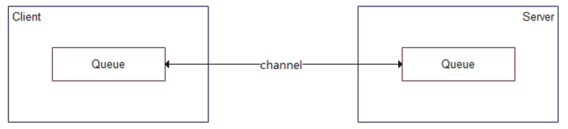
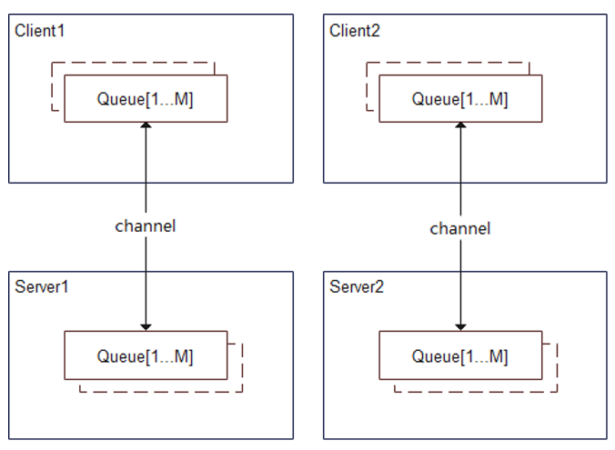
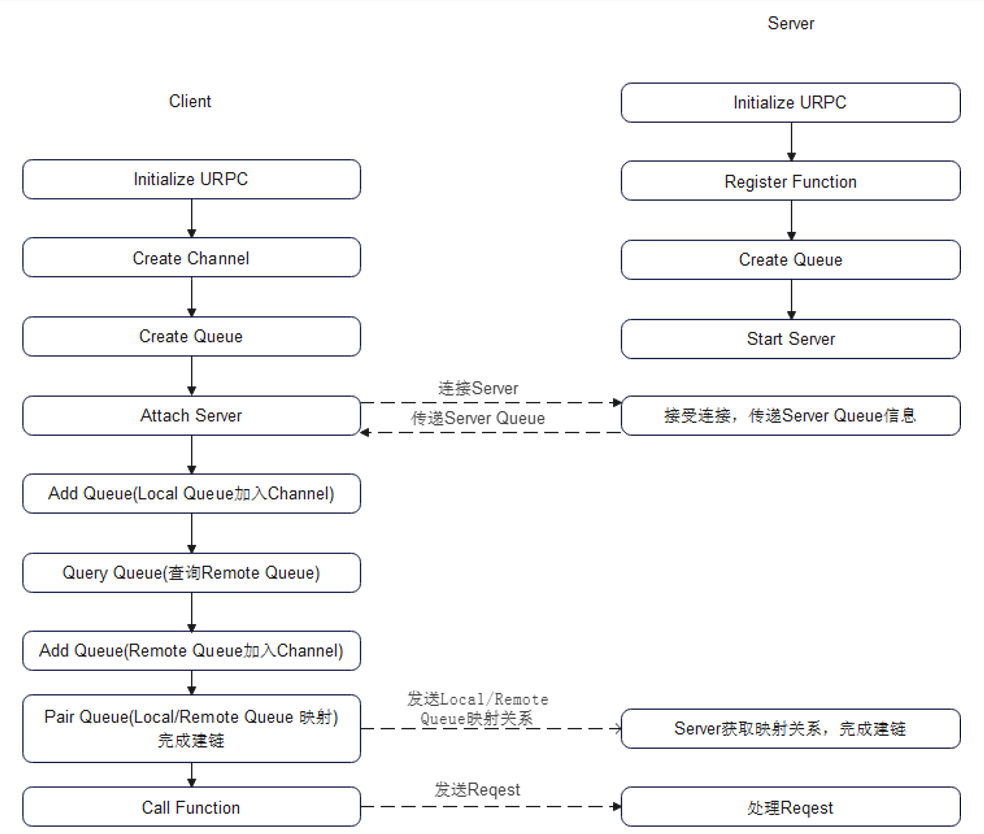
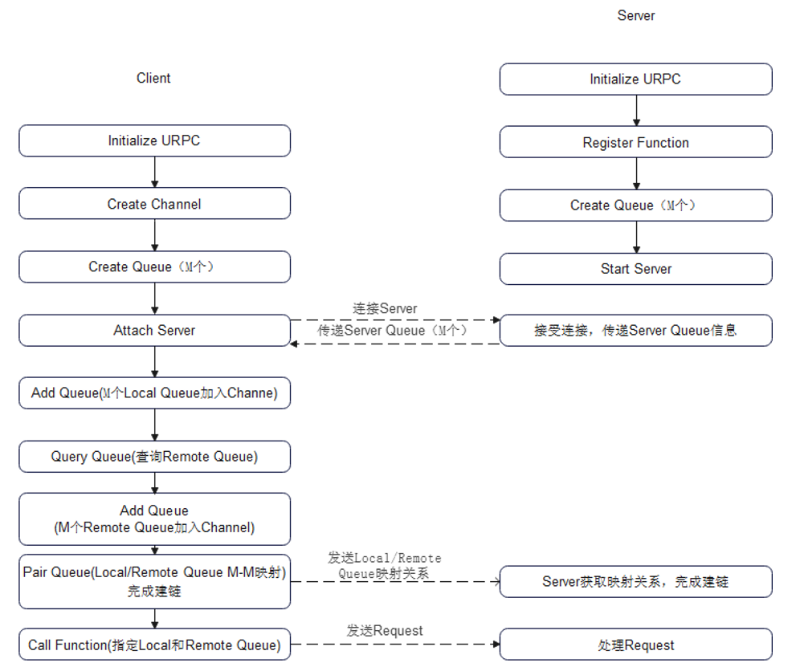
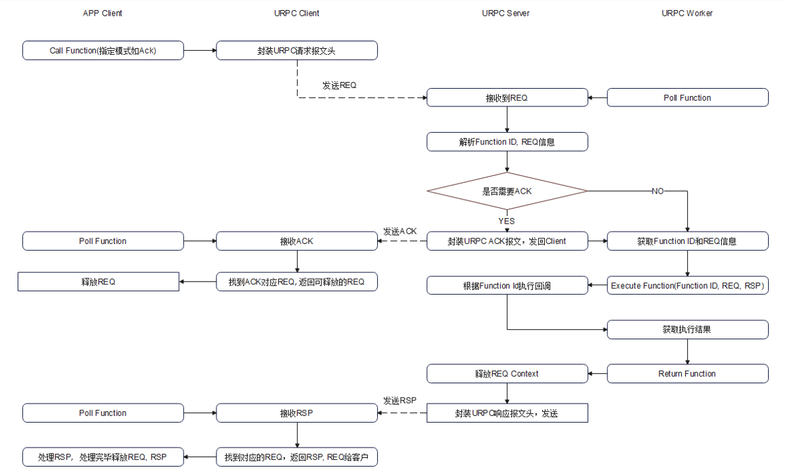

## 接口文件列表：
[urpc_framework_api.h](../../src/urpc/include/framework/urpc_framework_api.h)

## 整体说明

Channel 与 Queue 基本概念

- **Channel**：URPC 基础传输单元，包含源端传输资源以及目的端传输资源的集合；
- **Queue**：一份源端或者目的端传输资源，不同场景可映射不同的实体（如 Jetty 等）。

基础语义

1. 用户创建一个 Channel；
2. 用户创建 Queue，初始化对应场景的实体（如 Jetty 等）；
3. 用户将 Queue 关联到 Channel；
4. 用户使用 Channel，基于 Channel 关联的 Queue 发送 RPC 请求。

Peer 模型：Local / Remote 端均有 Queue。

一个源Queue和一个目的Queue配对，一个Channel支持加入一对Queue或多对Queue配对

## URPC管理面流程

创建前准备

- **Initialize URPC**：Client 与 Server 初始化必要的资源；
- **Register Function**：Server 注册定制函数，获取 Function ID。

创建流程

1. **Create Channel**：Client 侧创建一个 Channel；
2. **Create Queue**：Client 与 Server 侧创建 Queue，基于传入的模式初始化对应传输层资源（如 Jetty 等）；
3. **Start Server**：Server 侧资源创建完毕，启动监听线程，允许 Client 来 Attach；
4. **Attach Server**：Client 侧 Channel 挂载到一个 Server 上，Server 侧的 Queue 信息以及函数信息交换回 Client；
5. **Add Queue (Local Queue)**：Client 侧将本地 Queue 加入 Channel；
6. **Query Queue (Remote Queue)**：Client 侧从 Channel 中查询从 Server 交换过来的远端 Queue 信息；
7. **Add Queue (Remote Queue)**：Client 侧将远端 Queue 加入 Channel；
8. **Pair Queue**：Client 在本端完成 1-1 映射操作后， 创建TP，将映射信息发送给Server，Server 完成创建 TP；
9. **Call Function**：管理面创建完毕后，支持指定 URPC Channel ID 开始数据面函数调用。

注1：TP = Transport Pair；

URPC管理面创建前准备，同Peer模型场景流程(单队列)。

创建流程

1. **Create Channel**：Client 侧创建一个 Channel；
2. **Create Queue**：Client 与 Server 侧创建 M 个 Queue，基于传入的模式初始化对应传输层资源（如 Jetty 等）；
3. **Start Server**：Server 侧资源创建完毕，启动监听线程，允许 Client 来 Attach；
4. **Attach Server**：Client 侧 Channel 挂载到一个 Server 上，Server 侧的 M 个 Queue 信息以及函数信息交换回 Client；
5. **Add Queue (Local Queue)**：Client 侧将本地 M 个 Queue 加入 Channel；
6. **Query Queue (Remote Queue)**：Client 侧从 Channel 中查询从 Server 交换过来的远端 Queue 信息；
7. **Add Queue (Remote Queue)**：Client 侧将远端 Queue 加入 Channel；
8. **Pair Queue**：Client 在本端完成 M-M 映射操作后，创建TP，将映射信息发送给Server，Server 完成创建 TP；
9. **Call Function**：管理面创建完毕后，支持指定 URPC Channel ID以及源/目的 Queue 映射对开始数据面函数调用。

注1：TP = Transport Pair；

## URPC数据面流程

交互流程

1. **Call Function**：Client 侧 APP 调用该 API 发起一个 URPC 函数，封装 REQ 报文头，并将其发送给 Server；  
2. **Poll Function**：Worker 调用该 API 执行 Poll，获取 REQ（参数）、Function ID 等函数执行所需信息；如果是 ACK 模式，Server 会回复 URPC ACK 给 Client；
3. **Poll Function（ACK 模式）**：Client 侧 APP 调用该 API 获取 ACK 事件以及可释放的 REQ，并释放 REQ；
4. **Execute Function**：Worker 调用该 API 基于 Function ID 和 REQ（参数）执行定制函数，回调注册的定制函数，获取 RSP；公共函数 APP 直接执行，无需调用该 API；
5. **Return Function**：Worker 调用该 API 将 RSP 返回给 Client 侧，URPC Server 封装 RSP 报文头，并将其发送给 Client；
6. **Poll Function（Response）**：Client 侧 APP 调用该 API 获取 RSP 以及可释放的 REQ，处理 RSP 并释放 REQ。  

