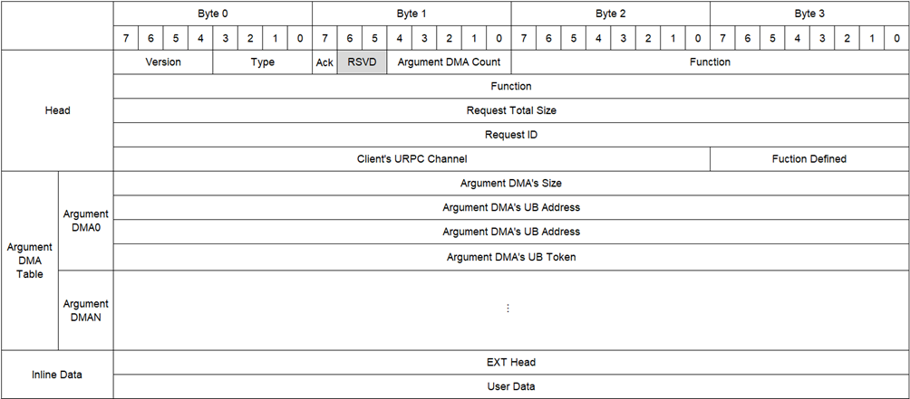
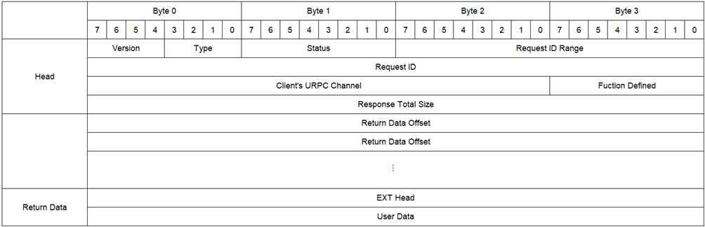

## 概述

本章列出URPC协议支持的消息格式

## URPC Function

URPC通过Function识别调用哪类UBPU的哪种函数，分为固定的公共函数和可部署的定制函数。
公共函数（Public Method）在相同的UBPU类型（UBPU Class）和子类型（UBPU Subclass）中，具有统一的定义，包括函数、接口、参数等。
定制函数（Customized Method）可根据场景自定义能力、接口等，URPC协议不做约束，可以动态地在Server/Worker上部署和删除，供Client调用。

| 域段名       | 位宽（Bits） | 说明 |
|--------------|--------------|------|
| UBPU Class   | 12           | 指示 UBPU 类型 |
| UBPU Subclass| 12           | 指示 UBPU 子类型 |
| P[rivate]    | 1            | ● 0：Method 是固定的公共函数（Public Method）； ● 1：Method 是可部署的定制函数（Customized Method）； |
| Method       | 23           | 指示 URPC 的调用函数 |

Client 可以通过预定义的 Method 实现对 Server/Worker 的公共函数/定制函数的查询、定制函数的部署、定制函数的删除等。

保留的 P[rivate] + Method：

- 公共函数：  
  - 0b0000_0000_0000_0000_0000_0000：查询 UBPU 支持的公共函数；

- 定制函数：
  - 0b1000_0000_0000_0000_0000_0000：查询 UBPU 支持的定制函数；
  - 0b1000_0000_0000_0000_0000_0001：部署新的定制函数；
  - 0b1000_0000_0000_0000_0000_0010：删除已部署的定制函数；
  - 0b1000_0000_0000_0000_0000_0011：查询指定名称的 Method；

| UBPU Class | UBPU Subclass | P | Method |
|------------|---------------|---|--------|
| [47:36]    | [35:24]       | [23:23] | [22:0] |
| 0x002      | 0x001         | 0 | … |

## URPC Message

URPC Message是URPC Client和URPC Server之间的交互报文，其格式定义如下。

### 域段定义

| 域段名 | 位宽（Bits） | 说明 |
|--------|--------------|------|
| Type   | 4            | 指示 URPC Message 的类型格式： ● 0：URPC Request； ● 1：URPC Ack； ● 2：URPC Response； ● 3：URPC Ack + URPC Response（Message 格式与 URPC Response 相同）； |

### URPC Request

| 域段名                    | 位宽（Bits） | 说明 |
|---------------------------|--------------|------|
| Version                   | 4            | URPC 版本号，当前版本号为 1 |
| Type                      | 4            | 指示 URPC Message 的类型格式，本报文填 0 |
| Ack                       | 1            | 指示 URPC 调用流程中是否需要 URPC Ack。Server 自主决定 URPC Ack 与 URPC Response 是否合并返回。 ● 0：不包含 URPC Ack； ● 1：包含 URPC Ack； |
| Argument DMA Count        | 6            | 指示 Server 执行的 Argument DMA 的数量 当 Argument DMA Count == 0 时，Argument DMA Table 不存在 |
| Function                  | 48           | 指示 URPC 调用的 Function |
| Request Total Size        | 32           | 指示 URPC Request 的大小（单位 Byte），包含协议头（Head）和全部参数分片的总大小，不包含 Argument DMA Table 的大小 |
| Request ID                | 32           | 唯一的 URPC 调用标识，用于匹配 Request 与 Ack/Response |
| Client's URPC Channel     | 24           | 指示发送 URPC Request、接收 URPC Ack/Response 的 Client 侧 URPC Channel |
| Function Defined          | 8            | 指示函数面向的领域，用于确定 URPC 扩展头的类型： ● 0：无扩展头； ● 1：通用计算扩展； ● 2：存储 PLOG 扩展； ● 其它：待定义； |
| Argument DMA's Size       | 32           | 指示 Server 执行的 Argument DMA 的大小 |
| Argument DMA's UB Address | 64           | 指示 Server 执行的 Argument DMA 的 UB 地址 |
| Argument DMA's UB Token   | 32           | 指示 Server 执行的 Argument DMA 的 UB Token |
| EXT Head                  | -            | URPC Request 扩展协议，具体域段自定义 |
| User Data                 | -            | 在 URPC Request 中直接传输的用户数据 |
| Inline Data               | -            | 在 URPC Request 中直接传输的数据，包含 URPC 扩展头（EXT Head）和用户数据（User Data） |

### URPC Ack

| 域段名                | 位宽（Bits） | 说明 |
|-----------------------|--------------|------|
| Version               | 4            | URPC 版本号，当前版本号为 1 |
| Type                  | 4            | 指示 URPC Message 的类型格式： ● 1：URPC Ack 报文独立； ● 3：URPC Ack 和 URPC Response 报文合并（Message 格式与 URPC Response 相同）； |
| Request ID Range      | 16           | 指示 URPC Ack/Response 包含的 Request ID 的范围。URPC Ack/Response 集体传输需满足条件： ● Request ID 连续； ● URPC Channel 相同； ● Status 相同； 默认值是 1，仅包含当前 Request ID 的 URPC Response |
| Request ID            | 32           | 唯一的 URPC 调用标识，用于匹配 Request 与 Ack/Response |
| Client's URPC Channel | 24           | 指示发送 URPC Request、接收 URPC Ack/Response 的 Client 侧 URPC Channel |

### URPC Response

| 域段名                  | 位宽（Bits） | 说明 |
|-------------------------|--------------|------|
| Version                 | 4            | URPC 版本号，当前版本号为 1 |
| Type                    | 4            | 指示 URPC Message 的类型格式： ● 2：URPC Response 报文独立； ● 3：URPC Ack 和 URPC Response 报文合并（Message 格式与 URPC Response 相同）； |
| Status                  | 8            | ● 0：Worker 执行 URPC 完成； ● 1：Server 拒绝执行； ● 2：调用 Function 不支持； ● 3：Server 的 Argument Buffer 不足； ● 4：URPC 调用超时； ● 5：Version 不匹配； ● 6：URPC 协议头错误； ● 其它：待定义； |
| Request ID Range        | 16           | 指示 URPC Ack/Response 包含的 Request ID 的范围。URPC Ack/Response 集体传输需满足条件： ● Request ID 连续； ● URPC Channel 相同； ● Status 相同； 默认值是 1，仅包含当前 Request ID 的 URPC Response |
| Request ID              | 32           | 唯一的 URPC 调用标识，用于匹配 Request 与 Ack/Response |
| Client's URPC Channel   | 24           | 指示发送 URPC Request、接收 URPC Ack/Response 的 Client 侧 URPC Channel |
| Function Defined        | 8            | 指示函数面向的领域，用于确定 URPC 扩展头的类型： ● 0：无扩展头； ● 1：通用计算扩展； ● 2：存储 PLOG 扩展； ● 其它：待定义； |
| Response Total Size     | 32           | 指示 URPC Response 的大小（单位 Byte），包含协议头（Head）和 Return Data 的总大小，不包含 Return Data Offset 的大小 |
| Return Data Offset      | 32           | 当 Return Data 存在时，指示集体传输 URPC Response 的每个 Request ID 的 Return Data 的偏移。 ● 集体传输 URPC Response 的第一个 URPC Request（Request ID - Request ID Range + 1）的 Return Data Offset 默认等于 0，并且省略； ● Return Data Offset 的排列顺序依次从（Request ID - Request ID Range + 2）到 Request ID； ● 当 Return Data 不存在时，Return Data Offset 不存在； ● 当 Request ID Range == 1 时，Return Data Offset 不存在； |
| EXT Head                | -            | URPC Response 扩展协议，具体域段自定义 |
| User Data               | -            | 在 URPC Response 中传输的用户数据 |
| Return Data             | -            | 在 URPC Response 中传输的响应数据，包含 URPC 扩展头（EXT Head）和用户数据（User Data） |
