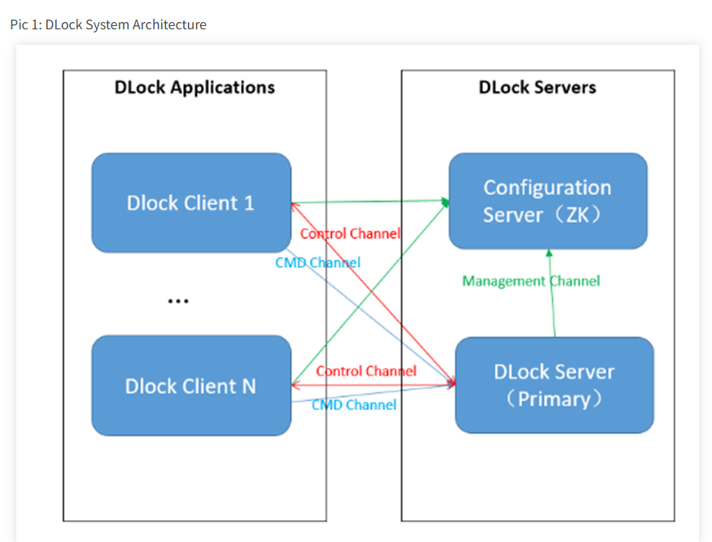
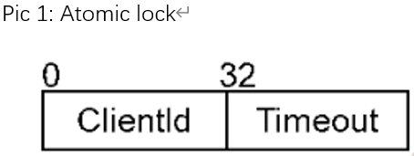
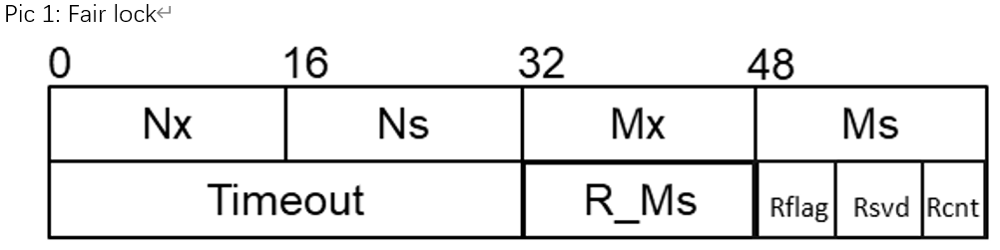
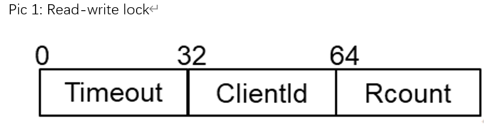

# DLock

## 1. Introduction
DLock is a general-purpose distributed lock service built upon UMDK, achieving the goals of low latency and high reliability. It supports atomic locks, read-write locks, and fair locks. Additionally, DLock provides distributed object management services, offering the capability to set and retrieve global transaction objects. This accelerates the unified allocation of global transaction resources and provides foundational capabilities for multi-write/multi-read scenarios, such as in databases.

## 2. Usage Guide
The externally APIs of DLock are located in the "src/ulock/dlock/lib/include" directory. Server APIs are in "dlock_server_api.h", client APIs are in "dlock_client_api.h", and external data structures are defined in "dlock_types.h". For detailed usage instructions, please refer to the DLock API Guide.

## 3. Compilation and Installation
### Compiling the DLock RPM Packages
**Compile DLock Separately**
Navigate to the root directory of the UMDK project
```bash
tar -czf /root/rpmbuild/SOURCES/umdk-25.12.0.tar.gz --exclude=.git `ls -A`
rpmbuild -ba umdk.spec --with dlock
```

**Explanation of Additional DLock Compilation Options**
- RPM Compilation Options: \
--with ubagg_disable                              (option, i.e. enable ubagg by default) \
--with asan                                       (option, i.e. disable asan by default) \
--with tsan                                       (option, i.e. disable tsan by default) \
--with gcov                                       (option, i.e. disable gcov by default)

### Installing the DLock RPM Packages
Note: DLock needs to work together with the URMA feature. Before compiling and installing DLock, ensure that URMA has been installed. \
rpm -ivh /root/rpmbuild/RPMS/aarch64/umdk-dlock-*.rpm

### Compilation and Installation via CMake Command
**Compile DLock Separately**
Navigate to the src directory and run the CMake command for compilation and installation:
```bash
cd src  
mkdir build; cd build  
cmake .. -DBUILD_ALL=disable -DBUILD_DLOCK=enable  
make && make install
```

**Explanation of Additional DLock Compilation Options**
- cmake Compilation Options: \
-DUB_AGG_DIS=enable                               (option, i.e. enable ubagg by default) \
-DASAN=enable                                     (option, i.e. disable asan by default) \
-DTSAN=enable                                     (option, i.e. disable tsan by default) \
-DCODE_COVERAGE=enable                            (option, i.e. disable gcov by default)

## 4. Software Architecture
The overall architecture of DLock is shown in the figure below, divided into client and server components. The client is deployed alongside the application, which performs distributed lock operations through the client. The server can be deployed separately or with the application, primarily consisting of a configuration server and the DLock primary server node. The implementation of the configuration server is business-scenario-dependent and is the application's responsibility; DLock does not handle it.



The DLock client provides distributed lock interfaces to the application in the form of a dynamic library. The DLock client can create multiple client instances. The current release does not support client instances within the same process connecting to different DLock servers. Each client instance caches the locks and state information it needs to operate on locally to accelerate distributed lock operations.

The DLock server provides DLock server management interfaces to the application and distributed lock services to DLock clients in the form of a dynamic library. Multiple independent, unrelated DLock server instances can be created within a single process, each running in primary server mode. The Primary Server mode maintains all connected clients, along with the currently serviced locks and state information. Two channels are established between the primary server and clients: \
(1) a TCP-based control channel for client registration/de-registration, and lifecycle management of distributed locks and state objects; \
(2) a URMA-based command channel for fast execution of basic operations on distributed locks and objects.

## 5. Distributed Locks
DLock includes three types of distributed locks: Atomic Lock, Read-Write Lock and Fair Lock.

### 5.1 Atomic Lock
Any time only one client can successfully acquire and hold an atomic lock. An atomic lock object is a 64-bit data structure composed of two parts: ClientId and Timeout. The ClientId occupies the high 32 bits, representing the lock owner's ID. The Timeout records the lock's expiration time, representing the time elapsed since the 1970 epoch in seconds. The specific composition is shown below:



### 5.2 Fair Lock
Any client's lock request (shared or exclusive) for a fair lock will be granted within a finite time, ensuring first-come-first-served fairness. The fair lock object size is 128 bits, with the specific composition shown below:



The fair lock consists of the following components:

Nx: Current exclusive lock service sequence number (16 bits) \
Ns: Current shared lock service sequence number (16 bits) \
Mx: Latest exclusive lock queue sequence number (16 bits) \
Ms: Latest shared lock queue sequence number (16 bits) \
Timeout: Lock validity period (valid timestamp) (16 bits) \
R_Ms: Shared lock queue head sequence number after a timeout event (16 bits) \
Rflag: Timeout event flag (1 bit). A value of 1 indicates a timeout-based lock acquisition occurred. This flag is cleared upon the first successful exclusive unlock after such an acquisition. \
Rsvd: Reserved field (9 bits) \
Rcnt: Read lock count (6 bits). The current 6-bit length limits the number of clients simultaneously holding shared locks to 63.

### 5.3 Read-Write Lock (RW Lock)
A read-write lock can be in one of two mutually exclusive states: shared lock state or exclusive lock state. Both states must be entered via a lock operation from the free state. Only one client can be in the exclusive lock state at a time, or multiple clients can be in the shared lock state. Read-write locks do not support a timeout mechanism. The read-write lock object is a 64-bit data structure, as shown below:



The read-write lock object consists of three parts:

Time_out: Lock acquisition time (first time) (32 bits) \
ClientId: Owner ID for the exclusive lock (32 bits) \
Rcount: Shared lock count (32 bits)

Read-write locks have three valid states: free, exclusive lock state, and shared lock state, corresponding to four operation flows: exclusive trylock, shared trylock, exclusive unlock, and shared unlock. The timeout field records the lock time. Since read-write locks cannot timeout, a lock might be held indefinitely if not unlocked.

## 6. Control Plane Operations
A TCP-based control channel is established between the client instance and the server, used for client instance registration/de-registration, distributed lock lifecycle management, heartbeat detection, and failure recovery.

### 6.1 Client Management
A DLock client process can create multiple client instances connected to the DLock server. Applications can use the client management APIs provided by DLock to perform operations like client library context initialization/deinitialization and client instance registration/de-registration. In distributed business scenarios like databases and big data, to avoid data access conflicts and maintain consistency, each application node thread should create a corresponding DLock client instance and be assigned a client_id for distributed lock operations.

#### Usage Guide:
(1) Call "dclient_lib_init" to initialize the client library context based on configuration parameters. \
(2) Call "client_init" to create a Client instance. This requests a unique client ID  from the Primary Server based on input parameters, establishes Control and CMD Channels to the Primary Server, and maintains the connection. \
(3) Send distributed lock control requests (e.g., for lifecycle management like get_lock/release_lock and corresponding batch operations) to the primary server via the control channel. \
(4) Send distributed lock operation requests (e.g., trylock, unlock, lock, lock_extend, and corresponding batch operations) to the primary server via the command channel. \
(5) Call "client_deinit" with the specific client_id to destroy the corresponding client instance, disconnect from the Primary Server, and reclaim resources. \
(6) Call dclient_lib_deinit to destroy the client library context.

If a DLock API returns "DLOCK_BAD_RESPONSE", it indicates a network issue, message send/receive timeout, or response verification failure. The client instance needs reinitialization and reconnection before retrying the lock operation. 

Basic process: \
(1) Call "client_reinit" to restart the client instance and connect to the Primary Server. \
(2) Call "client_reinit_done" to inform the Primary Server that client instance reinitialization is complete. \
(3) Retry the corresponding API call.

#### Notes:
(1) DLock supports Client and Server residing in the same process. \
(2) A maximum of 32 Client instances can coexist simultaneously in one process. \
(3) "dclient_lib_init" and "dclient_lib_deinit" need only be called once per process. The DLock client does not guarantee thread safety for concurrent multi-threaded execution of these functions. \
(4) The DLock client does not guarantee thread safety for concurrent multi-threaded execution of "client_init", "client_reinit" and "client_deinit". \
(5) The DLock client does not guarantee thread safety for multiple threads using the same client instance. It is recommended that different threads use different client instances (distinguished by client_id). Otherwise, the service caller must implement protection measures to prevent access conflicts. \
(6) If "client_reinit" consistently fails, the user needs to call "client_deinit" to destroy the original client instance.

### 6.2 Server Management
Applications can use the server management APIs provided by DLock to perform server library context initialization/deinitialization and Primary Server creation/destruction operations. In distributed business scenarios like databases and big data, these operations are performed on the nodes providing the distributed lock service.

#### Usage Guide:
Applications call the DLock server's corresponding functions via API interfaces. The basic process is as follows: \
(1) Call dserver_lib_init to initialize the server library context based on configuration parameters.

(2) Call server_start to launch a Primary Server based on configuration parameters and assign it a server_id. \
For the Primary Server, after startup it performs the following tasks: \
Initializes server resources and creates service ports for clients. \
Accepts client join requests, establishing control and command channels with clients. \
Receives distributed lock control plane and data plane requests from clients, processes them, and replies.

(3) Call server_stop with a specific server_id to destroy the corresponding Server, terminate related threads, and release its resources.

(4) Call dserver_lib_deinit to deinitialize the server library context. This iterates through and destroys all Servers.

#### Notes:
(1) A maximum of 32 Servers can coexist simultaneously in one process. Clients uniquely identify a Primary Server by its IP and service port. \
(2) A single Primary Server can accept connections from a maximum of 1000 Client instances simultaneously. \
(3) A single Primary Server can manage a maximum of 51,200 locks simultaneously. Users must constrain lock usage to not exceed this limit; acquiring locks beyond this limit will fail. \
(4) The configurable port range for the client-facing management plane service is 1024~65535. If the configured port number is <=0, the default port 21616 is used. If the configured port falls within the system's ephemeral port range (Linux parameter: ip_local_port_range), it might be occupied, causing server_start to fail. It is recommended to avoid conflicts with the ephemeral port range or assign the management service port to ip_local_reserved_ports. \
(5) The DLock server uses a polling mode to handle distributed lock control and data plane requests, utilizing 2 CPU cores. \
(6) The DLock caller must ensure cluster time synchronization. When setting lock timeout periods, consider clock jumps causing lock invalidation and extend lock times promptly. \
(7) The server enables unilateral keepalive detection. The current settings are: idle time 60 seconds, probe count 9, probe interval 6 seconds. If a client experiences a network disconnection (e.g., NIC down), the keepalive mechanism allows the server to detect it and mark the client as abnormal. If the server is at its capacity (1000 clients) and receives a new client initialization request, it will delete the information of a marked abnormal client to serve the new request. However, if the disconnected client reconnects before the capacity is exceeded, its abnormal mark will be removed, restoring it to a normal client.

## 7. Distributed Lock Operations
Applications send distributed lock lifecycle management requests through the client. The server processes these requests and returns results.

### 7.1 Distributed Lock Lifecycle Management
#### 7.1.1 Basic Lock Operations
The client calls "get_lock" to create or acquire a distributed lock object from the server. The client calls "release_lock" to release an acquired distributed lock object to the server.

##### Notes:
(1) After a DLock Client instance calls "get_lock", it should ensure that "release_lock" is called afterwards. Otherwise, the lock object will continue to occupy server resources until all client instances that have acquired the lock disconnect from the server and are removed by the server. At that point, the lock object will be destroyed as its reference count drops to zero. \
(2) If the currently specified "lease_time" is not effective, the DLock Server will not proactively destroy lock objects that have exceeded their lifecycle. Future versions may support lease_time, so users are currently advised to set it to the maximum value.

#### 7.1.2 Batch Lock Operations
The client calls "batch_get_lock" to batch create or acquire distributed lock objects from the server. The client calls "batch_release_lock" to batch release acquired distributed lock objects to the server. Currently, the batch size for management plane lock operations is limited to 31 objects per operation.

### 7.2 Distributed Lock Data Plane Operations
#### 7.2.1 Basic Lock Operations
The upper-layer application sends distributed lock operation requests through the client. The server processes the requests and returns results. The server process guarantees the atomicity of lock operation transactions. The DLock data plane supports basic distributed lock operations like trylock, unlock, lock, and lock_extend.

##### Usage Guide:
(1) The client calls "trylock" to perform a non-blocking lock acquisition operation on a lock and returns the result. \
(2) The client calls "unlock" to perform an unlock operation on a lock. \
(3) The client calls "lock" to perform a blocking lock acquisition operation on a lock object, which blocks until the lock is acquired or the operation times out. \
(4) The client calls "lock_request_async" to make an asynchronous lock operation request and then uses "lock_result_check" to query the result. This pair provides asynchronous functionality, while trylock/unlock/lock/lock_extend are synchronous interfaces. Users can choose as needed. \
(5) To prevent a client from holding a lock indefinitely and blocking others, a validity period is set upon successful lock acquisition. Locks expire automatically after this period. A lock-holding client can call "lock_extend" to request an extension. The server decides based on the lock's status and returns the result. Read-write locks do not have a validity period and do not support "lock_extend".

##### Notes:
Before performing lock operations (trylock/unlock/lock/lock_extend) on a distributed lock object, the client must have successfully acquired the object via get_lock. After all operations are complete, the object must be released via release_lock.

#### 7.2.2 Batch Lock Operations
DLock provides batch processing functionality for some distributed lock operations. Batch operations do not guarantee overall transaction semantics but do guarantee atomicity for individual operations. Batch lock operations can improve efficiency in scenarios involving frequent locking/unlocking of large numbers of distributed lock objects.

##### Usage Guide:
(1) The client calls "batch_trylock" to perform batch trylock operations on distributed lock objects. \
(2) The client calls "batch_unlock" to perform batch unlock operations on distributed lock objects. \
(3) The client calls "batch_lock_extend" to batch request lock validity period extensions from the server.

##### Notes:
Currently, the batch size for data plane lock operations is limited to 31 objects per operation.

## 8. Distributed Objects
Distributed objects are 64 bits in size. The client supports sending control requests for these objects to the server via the control channel for lifecycle management (creation, destruction, acquisition, release). It also supports sending operation requests via the command channel, including atomic FAA/CAS operations and snapshot retrieval.

### 8.1 Distributed Object Lifecycle Management
The DLock management plane supports basic operations like creation, destruction, acquisition, and release of distributed objects.

#### Usage Guide:
(1) If the distributed object does not exist, the client must call "umo_atomic64_create" to create it on the server. \
(2) The client calls "umo_atomic64_get" to request acquisition (a reference to) the object from the server. \
(3) After all data plane operations are complete, if the object is no longer needed, the client calls "umo_atomic64_release" to release the acquired object from the server. \
(4) When the application process exits, the client should call "umo_atomic64_destroy" to request the server to destroy any distributed objects it created.

#### Notes:
(1) It is recommended that a specific client creates the distributed object during application service initialization, and the same client destroys it upon service exit. \
(2) If client instances haven't released the object, destroying it may return success, but the object is only marked for "destruction" on the server. Its resources are truly released only when the reference count drops to zero or its lifecycle times out. \
(3) DLock is not responsible for persisting distributed objects. If the Server fails, after recovery, the application must call DLock client interfaces ("umo_atomic64_create" and "umo_atomic64_get") to recreate and reacquire the objects, passing the initial value during creation.

### 8.2 Distributed Object Operations
The DLock data plane supports basic operations on distributed objects: Atomic Fetch-and-Add (FAA), Compare-and-Swap (CAS), and retrieving object snapshots. Databases often require unified allocation of special global transaction resources (e.g., CSN, Xid). DLock's distributed object management service provides the ability to set and get these global transaction objects (persistence is the database's responsibility), accelerating unified allocation and enabling multi-write/multi-read database capabilities.

#### Usage Guide:
(1) After acquiring a distributed object, the client can call "umo_atomic64_faa" to request an atomic Fetch and Add operation on the object from the server, returning the original value. \
(2) After acquiring a distributed object, the client can call "umo_atomic64_cas" to request an atomic Compare and Swap operation on the object from the server, returning the new value after modification. \
(3) After acquiring a distributed object, the client can call "umo_atomic64_get_snapshot" to request the current value of the object from the server.

## 9. Heartbeat Detection
DLock supports heartbeat detection between client and server. When a client is idle for extended periods, this function can periodically check the connection status.

#### Usage Guide:
Call the "client_heartbeat" interface for a specific client instance to perform a heartbeat check with the server.

## 10. Failure Recovery
After a DLock Primary Server failure, DLock supports creating a new Primary Server and recovering the global lock state from clients.

#### Usage Guide:
(1) The server calls "server_start" to launch a new Primary Server, assigns a server_id, and recovers the lock state based on the number of existing Clients. \
(2) The client calls "client_reinit". The client_id remains unchanged, the current lock state is preserved, the client is recreated, and it connects to the new Primary Server. \
(3) The client calls "update_all_locks" to synchronize its lock state with the new Primary Server. \
(4) After lock state synchronization is complete, the client calls "client_reinit_done" to inform the Primary Server that all its lock states have been synchronized, concluding the client instance re-registration process. \
(5) The client calls "lock_extend" to check the current lock state at the server and update its local state accordingly. \
(6) After server failure recovery, distributed state object information becomes invalid and is cleared. If necessary, the application must call the DLock client interfaces "umo_atomic64_create" and "umo_atomic64_get" to recreate and reacquire the objects, providing the initial value during creation.

#### Notes:
(1) The new Primary Server must be configured for time synchronization with the original server to prevent lock state invalidation. \
(2) Even with time synchronization configured, slight clock differences may exist, causing a lock that expired on the original server to not yet be expired on the new server. Other clients' lock requests for this lock will fail and should be retried. \
(3) After server recovery, the client's locally cached lock state might be inconsistent with the server's (e.g., due to a server clock jump, the client's lock might have expired). Therefore, after recovery, the client must execute "lock_extend" to check and update the lock state from the server. \
(4) If needing to re-execute "client_reinit" and synchronize lock state, the distributed lock service must be restarted on all nodes simultaneously, and failure recovery operations must begin anew. \
(5) The Primary Server's recovery of global lock state from clients has no timeout mechanism and no API to notify the upper application. The application can infer that the Primary Server has not recovered if client operations return DLOCK_NOT_READY. If this persists beyond a preset handling time, failure recovery can be judged as failed, and all nodes should retry or enter a specific error handling process. \
(6) DLock is not responsible for persisting distributed objects; the application must handle this itself.

## 11. Secure Transport
Communication between DLock Client and DLock Server requires encryption. The connection establishment process uses the open-source OpenSSL component to create a secure transport channel. The minimum supported protocol version is TLS 1.3, and the cipher suite used is TLS_AES_256_GCM_SHA384.

Management Channel:

TCP link, supports encryption via SSL protocol. TLS establishes a secure management plane transport channel with mutual authentication between client and server.

Data Channel:

URMA connection, uses negotiated symmetric keys to encrypt transmission content. The symmetric key is negotiated after the TLS secure management channel is established: the Server generates the key and sends it to the Client; subsequent data content encryption is based on this key.

#### Usage Guide:
Enable secure transport mode by configuring the ssl_cfg parameter when calling "server_start" to launch the Primary Server. Enable secure transport mode by configuring the ssl_cfg parameter when calling "dclient_lib_init" to initialize the client library context.

Relevant configuration parameters are described below:

```bash
struct ssl_cfg {
    bool ssl_enable; // Secure transport mode switch. "true" enables secure transport mode.
    char *ca_path; // CA certificate path
    char *crl_path; // Path to certificate revocation list
    char *cert_path; // Client/Server certificate file path
    char *prkey_path; // Private key file path
    tls_cert_verify_callback_func_t cert_verify_cb; // Sets the certificate verification callback function.
    tls_prkey_pwd_callback_func_t prkey_pwd_cb; // Sets the callback function for obtaining the passphrase to decrypt the private key file.
    tls_erase_prkey_callback_func_t erase_prkey_cb; // Sets the callback function for erasing the decrypted private key passphrase from memory.
};

typedef int (*tls_cert_verify_callback_func_t)(void *ctx, const char *crl_path);    // crl_path might be a null pointer
typedef void (*tls_prkey_pwd_callback_func_t)(char ** prkey_pwd, int *prkey_pwd_len);
typedef void (*tls_erase_prkey_callback_func_t)(void * prkey_pwd, int prkey_pwd_len);
```

## 12. Version Negotiation During Connection Establishment
The DLock message protocol must be forward-compatible and extensible.
When extending DLock with new features, it must remain backward compatible, correctly recognizing and supporting older protocol versions with minimal resource overhead.
Therefore, DLock supports version protocol compatibility handling, performing version negotiation during connection establishment.

#### Usage Guide:
Protocol Version Definitions:

DLOCK_PROTO_VERSION: The default protocol version supported by DLock. \
DLOCK_MIN_PROTO_VERSION: The minimum compatible protocol version supported by DLock.

The CLIENT_INIT_REQUEST / CLIENT_REINIT_REQUEST messages carry the client's current default protocol version (version) and the minimum supported version (min_version).
Upon receiving these requests, the server compares versions: \
(1) If client version < server min_version, connection fails. The server replies with a response containing status code DLOCK_PROTO_VERSION_NEGOTIATION_FAIL. \
(2) If client min_version > server version, connection fails. The server replies with a response containing status code DLOCK_PROTO_VERSION_NEGOTIATION_FAIL. \
(3) cur_version = MIN(client version, server version). The request is processed normally, the connection is established, and the server replies with status code DLOCK_SUCCESS, placing the negotiated cur_version in the version field of the message header. \
(4) Both client and server locally record cur_version as the protocol version for all subsequent communication between them.