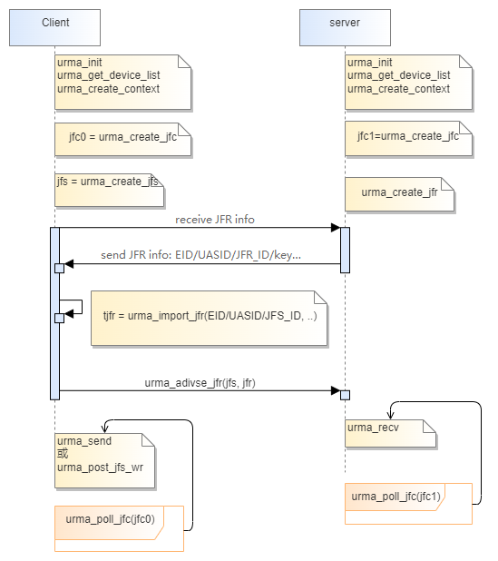
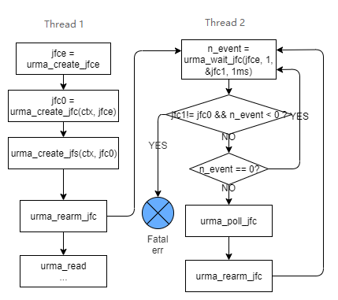
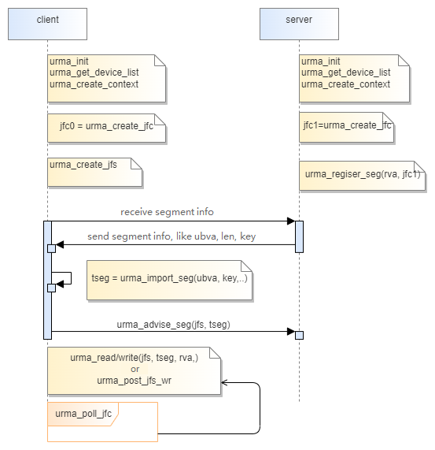

## URMA Interface Specification

Interface File List: \
[urma_api.h](../../src/urma/lib/urma/core/include/urma_api.h)

### Introduction to URMA
### 1. Basic Concepts
#### 1.1 UBVA Address Model
UBVA, Unified Bus Virtual Address, is a hierarchical virtual address on the UBUS bus. It supports unified addressing of shared memory across multiple nodes on the bus, breaking the address boundaries of individual nodes and allowing applications to perform cross-node addressing and data access through VA. It consists of three parts: EID/CID, UASID, and VA address.

#### 1.2 TPA (Tagged PA)
Tagged PA: Since remote memory needs to be mapped to the local physical address space, the concept of Tagged PA was introduced to distinguish it from the host's original physical addresses. Tagged PA is a contiguous segment of physical address space that is mapped to the corresponding UBEP device space. When remote memory is mounted locally, the UBEP driver allocates an address space of equivalent size.

#### 1.3 mVA (Mapped VA)
mVA refers to the virtual address allocated when remote memory is mapped into the local virtual address space. mVA is also a valid address in the process page table and can be translated into TPA by the CPU MMU. Access to mVA by the user ultimately translates into access to remote memory.

#### 1.4 Segment
A segment is a contiguous block of VA (Virtual Address) space, with physical memory allocated to correspond to this segment. It is created by the segment home node. The user-side application maps the segment to the process's virtual address space, allowing direct access to remote memory through the mapped address. The VA address of the segment can be the same as or different from the VA address mapped by the user process. The scenario where the VA addresses are the same is referred to as the DSVA (Direct Shared Virtual Address) scenario.

#### 1.5 URMA Region
The URMA Region, abbreviated as UR, is a management method for distributed shared memory, consisting of one or more segments. A UR is created by the owner node process. Multiple segments on a URMA Region may originate from different home nodes. Applications have the option to decide whether to create a UR.

#### 1.6 Jetty
Jetty is a queue used to manage submitted IO tasks or received messages, which can be considered as the "port" for URMA command execution. It consists of the following objects:
- **JFS (Jetty for send)**: Used to submit DMA tasks or send a message on the user side.
- **JFR (Jetty for receive)**: Used to prepare resources for receiving a message on the home side.
- **JFC (Jetty for completion)**: Used to store completion records of JFS/JFR. It can be bound to JFS or JFR, or specified separately in specific URMA commands.
- **JFCE (Jetty for completion event)**: Used to store completion events. A completion event refers to the pointer of the JFC where the new completion record is located. Multiple JFCs can be associated with the same JFCE, but it is not recommended to share the same JFCE among multiple threads.

### Management Interface Description
#### 1. Context Management
**Overview**:
URMA supports different hardware platforms. During initialization, it is necessary to configure the corresponding provider and specify the device to be used, thereby creating the context.

**Application Scenario**:
The context management of URMA needs to be executed at the initial stage of application runtime, and subsequent Jetty, Segment management, and data plane operations all depend on this operation.

**Instructions for Use**:
    (1) Call the `urma_init` function to configure the platform and set the `uasid`. If the `uasid` is not specified, the system will randomly assign one. Specifying a `uasid` may cause the function to fail. When using orchestration, you must configure `enable_orch=1`.
    (2) Call the `urma_query_device` function to query the device's attributes and obtain information such as the `eid`. If the application has already obtained the device's `eid`, this step can be skipped.
    (3) Call the `urma_create_context` function to create the device context.

#### 2. Jetty Management
**Overview**:
    URMA executes resource management through Jetty. Jetty serves as the operational object for URMA software, facilitating message interaction with the software via Jetty UBEP.
    Jetty is primarily used for receiving and sending message semantics, as well as issuing commands for memory semantics.
    Jetty is exclusive to the process and can be subdivided into Jetty For Send (JFS), Jetty For Receive (JFR), Jetty For Complete (JFC), and Jetty For Completion event (JFCE) based on different usage scenarios.

**Application Scenario**:
    Before performing specific operations such as read, write, send, and receive, it is necessary to establish the relevant Jetty resources. Subsequent operations like read, write, send, and receive all depend on the created Jetty resources.

**Important Notes**:
    When creating a JFC, it is necessary to specify the relevant JFCE to wait for completion events and retrieve completion records in interrupt mode.

**Instructions for Use**:
    (1) The programming framework for implementing message semantics using Jetty is illustrated below, where JFC represents the polling mode and does not bind to JFCE:

    (2) The interrupt mode utilizes the programming framework of JFCE as shown in the following diagram:

#### 3. Segment Management
**Overview**:
    A Segment is a contiguous block of VA (Virtual Address) space, with physical memory allocated to correspond to a segment.
    To obtain local memory, use `urma_register_seg` to get the ubva (User Base Virtual Address). To obtain remote memory, use `urma_import_seg` to get the ubva or mva (Memory Base Virtual Address).

**Application Scenario**:
    Memory management of urma semantics

**Precautions**:
    (1) When local users read from or write to remote memory, the local buffer and remote memory must be registered with the device using `urma_register_seg` in advance. If not in use, they must be unregistered using `urma_unregister_seg`.
    (2) Before an application reads from or writes to remote memory, it must call `urma_import_seg` to obtain the `target_segment`.
    (3) When registering a segment, if remote write or remote atomic permissions are declared, the application must also declare local write permissions; otherwise, the registration will fail.

**Usage Instructions**:
    (1) Using Local Memory: Allocate va, call urma_register_seg to register the segment.
    (2) Releasing Local Memory: Call urma_unregister to deregister the segment.
    (3) Using Remote Memory: Import the segment to obtain targ_segment and mva.
    (4) Releasing Remote Memory: Unimport the segment to deregister it.

The programming framework based on segment implementation of memory semantics is shown in the following figure:

### 4. Exceptional Events
**Overview**:
    (1) In cases where the application sends WRs that the hardware cannot process, accesses memory beyond the local or remote permissions, experiences Jetty or JFC overflow, driver unloading, or abnormal port status, the hardware will report exceptional events.
    (2) The application retrieves the type of exception that occurred and the specific object of the exception: the context of the exception, the port, JFS, JFC, JFR, etc. After the application has handled the exception, it confirms to UMDK that the exception handling is complete.

**Application Scenarios**:
    Urma Anomalous Scenarios

**Precautions**:
    Before deleting an object (such as JFS, JFR, JFC, Jetty), if you have received any exception events generated by this object, you must call the exception confirmation interface (urma_ack_async_event) before proceeding with the deletion of the object.

**Instructions for Use**:
    (1) The user invokes the urma_get_async_event interface to retrieve abnormal events;
    (2) The user categorizes and processes the abnormal events based on their type, such as printing log information;
    (3) The user calls the urma_ack_async_event interface to notify UMDK that the abnormal event has been processed.

#### 5. Device Attributes
The UB device attributes are broadly categorized into three types: read-only and immutable device resource specifications, readable and writable device configuration information, and read-only and mutable device port statuses. Currently, the urma framework uniformly presents these attributes through the sysfs file system, and these files can be directly manipulated using commands such as cat and echo.

### Data Plane Interface Description
#### 1. Unilateral Operations
**Overview**:
    UMDK unilateral operations provide read and write semantics, similar to the read/write interfaces of IB. They require knowledge of the local address and the peer's address. During unilateral operations, only the local process is involved, and the peer's application does not need to be aware.
    UMDK unilateral operation caching supports local contiguous memory, non-contiguous memory, and remote contiguous memory. `urma_read` and `urma_write` only support reading and writing to contiguous addresses. `urma_post_jfs_wr` supports accessing non-contiguous addresses in the form of an sgl on the local side.
    UMDK supports immediate number write operations, as seen in the `urma_post_jfs_wr` interface. The written immediate number will appear in the completion record on the receiving end.
    According to the UB protocol, write and read operations only support one remote sge. Therefore, for write operations, `dst.num_sge` must be 1, and for read operations, `src.num_sge` must be 1. Any additional sge will be ignored by the network card.

**Application Scenarios**:
    UMDK one-sided operations do not require the participation of the peer's CPU, unlike bilateral operations such as send/recv, which are generally used for transmitting some control information. One-sided operations like read/write are suitable for transmitting large amounts of data, enabling the movement of massive data sets, among other tasks.

**Precautions**:
    (1) The local cache sent and received by the user must be registered to the device by calling urma_register_seg in advance.
    (2) For the IB transport layer, before JFS sends a message to a certain JFR, it must call urma_advise_jfr to notify UMDK to establish a transmission channel from JFS to JFR. UB JFS inherently has one-to-many communication capabilities, so there is no need to call urma_advise_jfr before sending a message.
    (3) The maximum message size for different transport layers varies. The specifications for sending messages can be obtained by querying the device attributes.

**Instructions for Use**:
    The process for UMDK unidirectional read/write is as follows:
    (1) Call urma_read, urma_write, or urma_post_jfs_wr to submit a read or write request to the previously registered jfs.
    (2) Call urma_poll_jfc to poll and check if there are any cqe arrivals in the jfc. When urma_poll_jfc returns a value greater than 0, it indicates that a cqe has been polled, signifying the completion of the read operation. Only after the request is completed can the user reuse (modify or release) the message buffer that was sent.

#### 2. Bidirectional Operations
**Overview**:
    The message semantics provide a bidirectional Messaging service, similar to UDP/TCP socket interfaces or IB's send/receive interfaces. The message semantics of UMDK are asynchronous and non-blocking. The message receiver needs to explicitly receive the message, and after receiving, it reads the message to continue other processing.
    UMDK supports one-to-many message semantics: sending messages from the same JFS to different JFRs, which may be located on different remote nodes or processes.
    UMDK supports sending messages in an inline manner. When the message is smaller than the UMDK inline threshold, UMDK will automatically send the message in an inline manner, reducing DMA overhead to improve sending performance.
    UMDK bidirectional operations support both contiguous and non-contiguous memory on both the local and remote sides. urma_send and urma_recv only support contiguous addresses. urma_post_jfs_wr and urma_post_jfr_wr support the use of contiguous addresses or sgl-type non-contiguous addresses on both the local and remote sides.
    UMDK supports sending immediate numbers to the receiver, as seen in the urma_post_jfs_wr interface. The sent immediate numbers will appear in the completion record of the receiver.

**Application Scenarios**:
    Message semantics are widely applied, such as implementing MPI send and recv message sending, RPC semantics, and realizing UCX's am message semantics, among others.

**Precautions**:
    (1) The local cache sent and received by the user must be registered to the device by calling urma_register_seg in advance.
    (2) For the IB transport layer, before JFS sends a message to a certain JFR, it must call urma_advise_jfr to notify UMDK to establish a transmission channel from JFS to JFR. UB JFS inherently has one-to-many communication capabilities, so there is no need to call urma_advise_jfr before sending a message.
    (3) The maximum message size for different transport layers varies. The specifications for sending messages can be obtained by querying the device attributes.

**Usage Instructions**:
    The message receiving process is as follows:
    (1) Call `urma_recv` or `urma_post_jfr_wr` to submit a receive request, adding the local receive buffer to the JFR.
    (2) Call `urma_poll_jfc` to poll the receive request. Once the request is completed, the user can read the message content from the receive buffer.
    To improve throughput, the server can batch submit multiple receive requests. After successfully receiving each message, a new receive request is added to the JFR. Alternatively, when the number of receive requests in the JFR falls below a certain threshold, new receive requests are added to the JFR.
    The receiver obtains the specific length of the valid message received through the receive length in the completion record, and also learns whether the sender has sent an immediate number through the completion record.
    The message sending process is as follows:
    (1) The user calls `urma_send` or `urma_post_jfs_wr` to submit a send request through the JFS.
    (2) Call `urma_poll_jfc` to poll the send request. Once the request is completed, the user can reuse (modify or release) the send message buffer.

#### 3. Completion Record
**Overview**:
    The aforementioned unilateral, bilateral, and atomic operations are all non-blocking. A successful return from an operation only indicates that the command has been added to the send or receive queue, and does not mean that it has been fully completed.
    UMDK supports determining whether unilateral, bilateral, or atomic operations have been completed through polling or interrupt methods. The completion record is used to describe the completion information of the operation.
    After an operation is completed, the hardware writes the completion record to the JFC completion queue. When the user polls the JFC, UMDK reads the completion record from the completion queue and returns it to the user.
    The completion records for unilateral, bilateral, and atomic operations are by default written to the JFC associated with JFS or JFR. UB devices support specifying the JFC id to which the completion record should be written in the JFS command (i.e., WQE).

**Application Scenarios**:
    The polling method is applied in low-latency scenarios, where users continuously query to complete records and obtain the execution status of operations to proceed with the next steps. Continuous polling of operations will increase CPU usage. The interrupt method is used in scenarios where communication is not frequent. User threads wait in a sleep state for completion events, resulting in low CPU overhead. When a completion event occurs, the UMDK will wake up the waiting thread.

**Notes**:
    (1) When a user calls urma_recv, a completion record is always generated upon reception completion. When a user calls urma_read/write/cas/fao/send, a completion record is generated by default; if the JFC is in an event-enabled state (armed), a completion event is also generated by default.
    (2) If a user uses urma_post_jfs_wr to send requests in bulk, the user can specify whether to generate a completion record or a completion event.
    (3) When submitting operations (including unilateral, bilateral, atomic, etc.), the user must ensure that the JFC to which the completion record is to be written will not overflow.
    (4) If there are still unread completion records in the JFC, urma_rearm_jfc will return a failure.

**Usage Instructions**:
    Users call `urma_poll_jfc` to query completed records in a polling manner. Polling is a non-blocking method to query completed records. If the completion queue is empty, users will not be able to obtain any completed records. The **usage instructions** for completed records are as follows:
    (1) Users can determine whether an operation has been successfully completed by checking the status field of the completed record. If an error occurs, the status field of the completed record will indicate the reason for the failure.
    (2) The completion length represents the length of data that has been successfully executed, such as the length of data sent or the length of a received message.
    (3) If the completed record is of type JFS, users can modify or release the local cache corresponding to the operation.
    (4) If the completed record is of type JFR, it indicates that users can read messages from the receive buffer.
    (5) If the `notify_data` flag is enabled, the completed record also carries immediate data.
    (6) Users can associate the completed record with a specific operation by ensuring that the `completion_record_data` in the completed record matches the operation context (e.g., the `user_ctx` parameter in the `urma_read` API).
    The process of waiting for a completion event in interrupt mode is as follows:
    (1) Call `urma_rearm_jfc` to enable the completion event;
    (2) Submit a JFS operation (including unilateral, bilateral, atomic, etc.), specifying the completion record and completion time required;
    (3) Call `urma_wait_jfc` to block and wait for a completion event, returning the JFC that generated the completion event; UMDK will default to disabling the JFC completion event;
    (4) Determine if the returned JFC matches all the JFCs submitted in the JFS operation;
    (5) Loop through calling `urma_poll_jfc` to read the completion records until no new completion records are available;
    (6) Return to step (1) to re-enable the event.