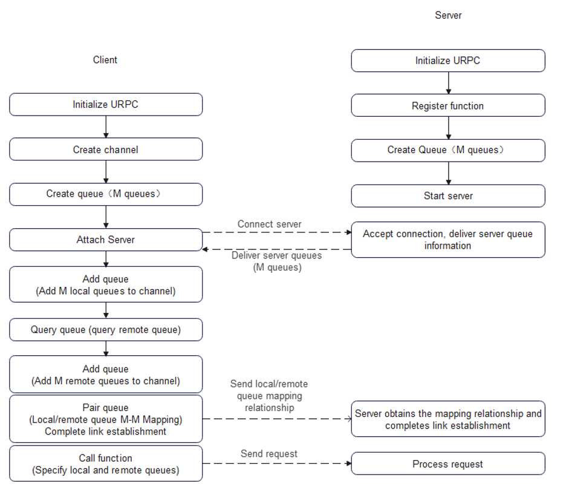
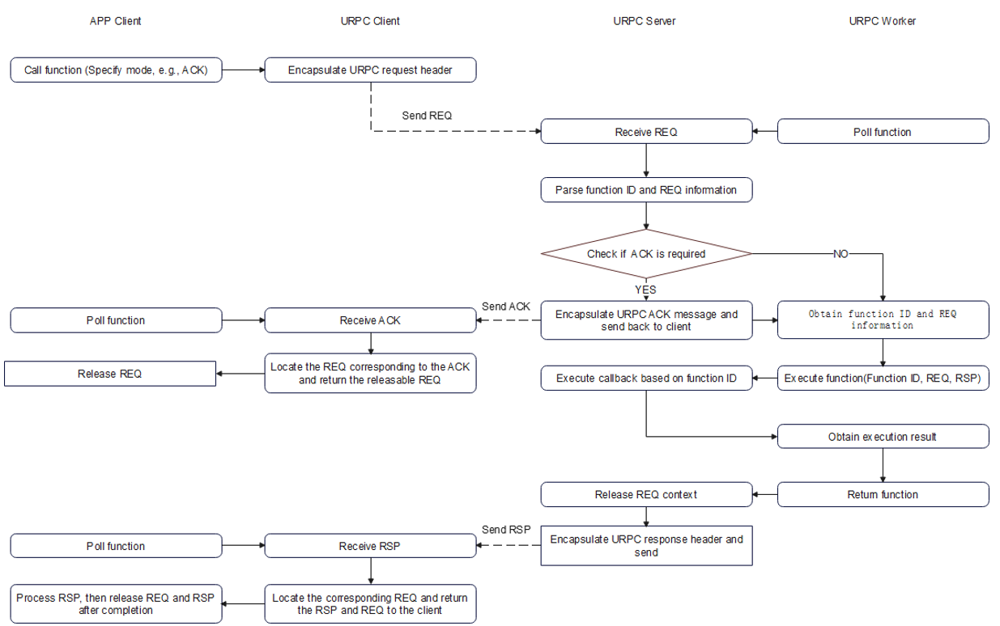

## Interface File List:
[urpc_framework_api.h](../../src/urpc/include/framework/urpc_framework_api.h)

## Overview

Channel and queue basic concepts

- **Channel**: The basic transmission unit of URPC, consisting of a collection of source-end and destination-end transmission resources.
- **Queue**: A source or destination transmission resource, which can be mapped to different entities in different scenarios (e.g., Jetty).

Basic semantics

1. The user creates a channel.  
2. The user creates a queue, initializing the corresponding entity for the scenario (e.g., Jetty).  
3. The user associates the queue with the channel.  
4. The user uses the channel to send RPC requests via the associated queue.  

Peer model: both local and remote sides have queues.  

A source queue and a destination queue form a pair. A channel can support one or multiple queue pairs.

## URPC control plane flow

Preparation

- **Initialize URPC**: The client and server initialize the necessary resources.  
- **Register function**: The server registers custom functions and obtains a function ID.  

Creation flow

1. **Create channel**: The client creates a channel.  
2. **Create queue**: The client and server create queues, initializing transport-layer resources based on the provided mode (e.g., Jetty).  
3. **Start server**: The server completes resource creation, starts a listening thread, and allows the client to attach.  
4. **Attach server**: The client channel attaches to a server. The server’s queue information and function information are exchanged back to the client.  
5. **Add queue (Local queue)**: The client adds the local queue to the channel.  
6. **Query queue (Remote queue)**: The client queries the channel for the remote queue information, exchanged from the server.  
7. **Add queue (Remote queue)**: The client adds the remote queue to the channel.  
8. **Pair queue**: After completing the 1-1 mapping locally, the client creates a TP and sends the mapping information to the server, which then creates the TP.  
9. **Call function**: Once the control plane is established, function calls on the data plane can be made by specifying a URPC channel ID.  

Note 1: TP = Transport pair.  

URPC control plane preparation is the same as the peer model flow (single queue).  

Creation flow

1. **Create channel**: The client creates a channel.  
2. **Create queue**: The client and server create M queues, initializing transport-layer resources based on the provided mode (e.g., Jetty).  
3. **Start server**: The server completes resource creation, starts a listening thread, and allows the client to attach.  
4. **Attach server**: The client channel attaches to a server. The server’s M queue information and function information are exchanged back to the client.  
5. **Add queue (Local queue)**: The client adds the local M queues to the channel.  
6. **Query queue (Remote queue)**: The client queries the channel for the remote queue information, exchanged from the server.  
7. **Add queue (Remote queue)**: The client adds the remote queues to the channel.  
8. **Pair queue**: After completing the M-M mapping locally, the client creates a TP and sends the mapping information to the server, which then creates the TP.  
9. **Call function**: Once the control plane is established, function calls on the data plane can be made by specifying the URPC channel ID and the source/destination queue mapping pairs.  

Note 1: TP = Transport pair.  

## URPC data plane flow

Interaction flow

1. **Call function**: The client APP calls this API to initiate a URPC function, encapsulates the REQ header, and sends it to the server.  
2. **Poll function**: The worker calls this API to poll and obtain the REQ (parameters), function ID, and other necessary information for function execution. If ACK mode is enabled, the server replies with a URPC ACK to the client.  
3. **Poll function (ACK mode)**: The client APP calls this API to obtain ACK events and releasable REQs, then releases the REQs.  
4. **Execute function**: The worker calls this API to execute the custom function based on the function ID and REQ (parameters), invoking the registered custom function and obtaining the RSP. Public functions are executed directly by the APP without this API.  
5. **Return function**: The worker calls this API to return the RSP to the client. The URPC server encapsulates the RSP header and sends it to the client.  
6. **Poll function (Response)**: The client APP calls this API to obtain the RSP and releasable REQs, processes the RSP, and releases the REQs.  
